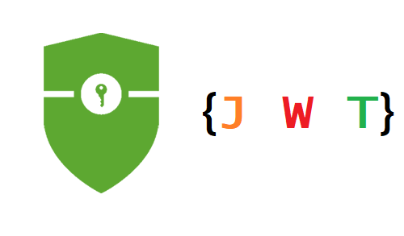

<p align="center">
 </a>
 </a>
 </a>
 </a>
</p>

## 📝 Table of Contents

- [About](#about)
- [Getting Started](#getting_started)
- [Usage](#usage)
- [Built Using](#built_using)
- [Authors](#authors)

## 🧐 About <a name = "about"></a>

This is Wallet write by - [Node.js](https://nodejs.org/) and deploy on - [Heroku](https://www.heroku.com).
Internet wallet

## 🏁 Getting Started <a name = "getting_started"></a>

These instructions will get you a copy of the project up and running on your local machine, everything you need - fork or copy this repository.

```
npm install

```

## 🎈 Usage <a name="usage"></a>

All methods how to use the system you can see on https://own-wallet.herokuapp.com/api-docs/#/.

## ⛏️ Built Using <a name = "built_using"></a>

- [MongoDB](https://www.mongodb.com/) - Database
- [Express](https://expressjs.com/) - Server Framework
- [NodeJs](https://nodejs.org/en/) - Server Environment
- [Passport](https://www.passportjs.org/) - Check user credencials
- [Cloudinary](https://cloudinary.com/) - Save user avatars
- [Sendgrid](https://sendgrid.com/) - Send mail to users

## ✍️ Authors <a name = "authors"></a>

- [@RuslanZahriadskyi](https://github.com/RuslanZahriadskyi)
